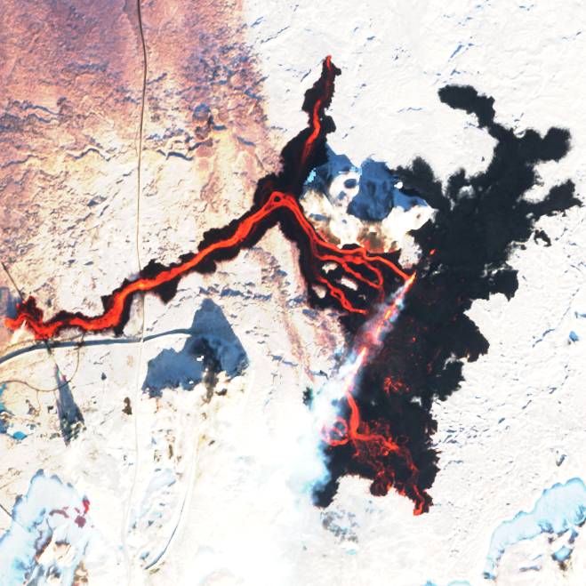

# Make NIR

This python script combines bands 8, 4, and 3 from Sentinel 2 data in .SAFE format to create a false-colour near-infrared image.



## Installation

This script requires gdal and libgdal-jp2openjpeg. It is easiest to install these with [conda](https://docs.anaconda.com/miniconda/). More details are available [here](https://gdal.org/en/latest/download.html#cross-platform-package-managers) but in brief:

Make a new conda environment:

```text
conda create -n sentinel2_nir
```

Activate the new environment:

```text
conda activate sentinel2_nir
```

Install gdal and libgdal (which contains libgdal-jp2openjpeg amongst other drivers):

```text
conda install -c conda-forge gdal libgdal
```

Clone this repository or simply copy paste the script to a local file:

```text
git clone https://github.com/wmoreland/make_nir.git
```

Change into the cloned directory and you're ready to run the script:

```text
cd make_nir
```

## Execution

The file contains an importable python function but the file can be ran directly from the command line:

usage: make_nir.py [-h] [-t] [-n] workspace

workspace should be a directory which contains a one or more directories of Sentinel 2 data in .SAFE format.

|             |positional argument |Description                                                              |
|-------------|--------------------|-------------------------------------------------------------------------|
|             |workspace           |Path to a directory containing one or more Sentinel 2 image sets         |

|short option |long option    |Description                                                                   |
|-------------|---------------|------------------------------------------------------------------------------|
|-h           |--help         |show help message and exit                                                    |
|-t           |--tiff         |Set this flag to output in GeoTiff format (default is VRT)                    |
|-n           |--no-overwrite |Set this flag to prevent overwriting existing files (default is to overwrite) |
